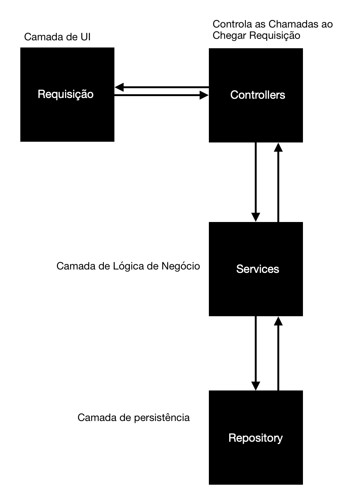
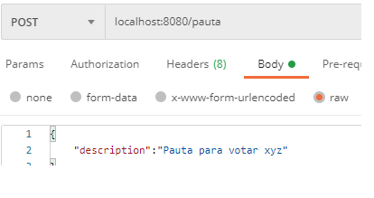
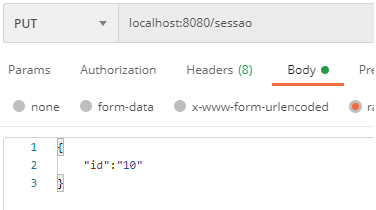
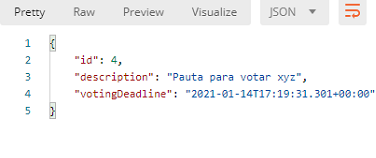
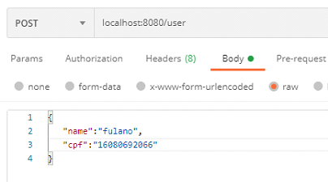
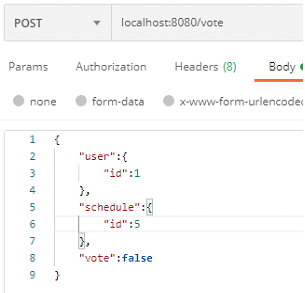
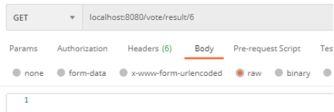
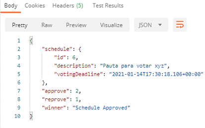

# APISpring
Este Documento: Relatório do Desafio de Implementação de Sistema de Votação 
Esse relatório tem por objetivo demonstrar como foi pensada a criação da solução para o desafio proposta de modelagem e implementação de um sistema de votos em pautas. A estrutura do sistema ficou da seguinte forma:

A primeira camada, representa o frontend, onde acontece a requisição de algo parao backend. Só foi implementado o backend e a parte de requisições foi testada com o Postman. Para a camada de persistência foi utilizado o postgreSQL 13, utilizando o pgAdmin 4. A linguagem utilizada para implementação foi Java e o framework Spring Boot, versão do SDK: Java 8 

#Criando Uma Nova Pauta:  

Para criar uma nova pauta, foi utilizado o POST method, através do POSTMAN, precisando apenas de sua descrição, pois o ID é gerado e incrementado automaticamente pelo Spring: 

#Abrindo Uma Sessão em Uma Pauta: 

Existe a opção de passar a data na requisição do POST junto para criar a sessão com este método, porém se a sessão não for criada através do POST, é possível criar através dom o método PUT, desta forma: 

O id é necessário para saber em qual pauta iremos querer iniciar a sessão. Dessa forma, por definição, é setado como 1 minuto a partir de agora o prazo de votação. 
Está sendo retornado o próprio objeto para fins de validação da requisição, pois também não trabalhei com informações sensíveis, mas se fosse necessário poderia retornar um DTO(Data Transfer Object). 

Após isso, temos que ter os usuários que irão votar na pauta, então eles são criados desta forma: 

#Criando Um Usuário: 

Para criar um usuário, deve-se passar o nome e um CPF, onde é necessário passar um CPF válido para a criação de um usuário, a validação é feita na package "validate". Para gerar um CPF válido é só vir nesse site https://www.4devs.com.br/gerador_de_cpf e clicar no botao de gerar um CPF. 
Lembre-se de deixar somente os números. 

#Votando: 

Para votar, é necessário especificar o id do usuário e o id da pauta, juntamente do voto True ou False. 

#Obtendo o Resultado da Votação: 

Após passar o tempo especificado como prazo final de votação, é possível pegar a informação dessa forma: 

#Resultado: 

#Testes
Os testes se encontram no Path /src/test/java/com/tests/
